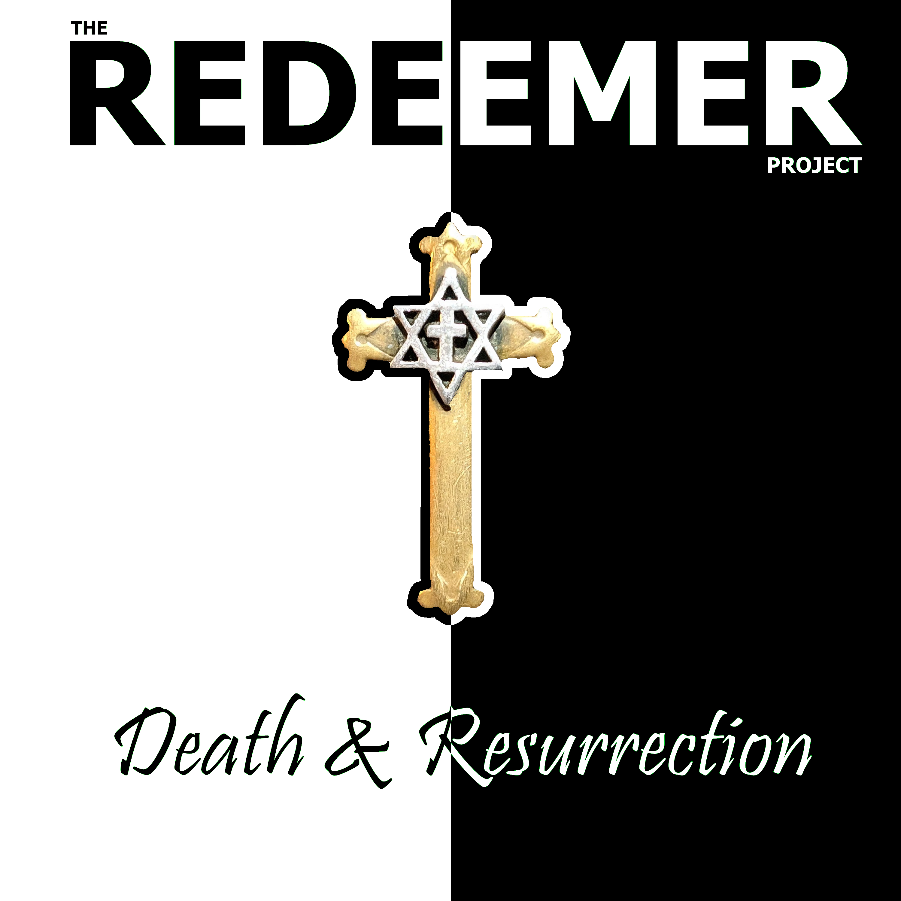
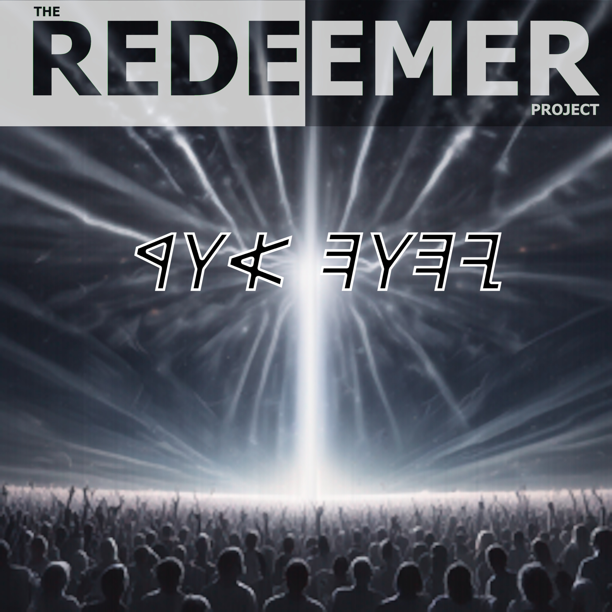

# Anonymous Download Page

Here is where you can download all my published music, free and anonymously.

These are hosted on Google Drive - so don't expect the downloads to be fast.

NOTE:  Google Drive will likely complain that it can't virus scan the file because it's too big. Click the Download Anyway button, knowing that I have produced and scanned these files myself and trust that they are virus-free.

If you want to stream the music, check out my [Bandcamp](https://theredeemerproject.bandcamp.com) page.

## Discography:

### Death and Resurrection (Released April, 2024)

(C) Copyright 2024, [Some rights reserved](https://creativecommons.org/licenses/by-nc-nd/3.0/)

Available in:
  * [MP3](https://drive.google.com/uc?export=download&id=1NIDUbxCC174t_MJppKlGOUf8tBywFNQ6) - High Quality 320kbit MP3 format (most compatible)
  * [AAC](https://drive.google.com/uc?export=download&id=1QxPkaxqyUOFsKWfv4D9qxJvA_NMJEJCg) - Apple m4a aac files (smallest)
  * [FLAC](https://drive.google.com/uc?export=download&id=1Ydt6YEuj0SjwoCystHKoLvvKzVmREpgi) - Lossless for audiophiles (largest file)
 

### Yahweh Our Light (Released June 2024)

(C) Copyright 2024, [Some rights reserved](https://creativecommons.org/licenses/by-nc-nd/3.0/)

Available in:
  * [MP3](https://drive.google.com/uc?export=download&id=1TbjAngWKZ66-W_YZ2Bmqh6DYQQZKQzU3) - High Quality 320kbit MP3 format (most compatible)
  * [AAC](https://drive.google.com/uc?export=download&id=1z5mg7j-ZQm_VTUPf65Nsrq2JZTYZ_cNx) - Apple m4a aac files (smallest)
  * [FLAC](https://drive.google.com/uc?export=download&id=1lKn2ovRRGN3dCu5q77DQ0yUQni_4eCLv) - Lossless for audiophiles (largest file)
 

### Americana [single] (Released July 4, 2024)

(C) 2024, [Some rights reserved](https://creativecommons.org/licenses/by-nc-nd/3.0/)

Available in:
  * [MP3](https://drive.google.com/uc?export=download&id=1OBII3h6rR5Cj76tTN46rDI5pjekZrYOP) - High Quality 320kbit MP3 format (most compatible)
  * [AAC](https://drive.google.com/uc?export=download&id=17ScDXfFsJhPKrIEKS_JoxShNUnfO0_pD) - Apple m4a aac files (smallest)
  * [FLAC](https://drive.google.com/uc?export=download&id=18U_T6MfryOgWyANNuxPKNSYAuamG-CqP) - Lossless for audiophiles (largest file)
 

## Other Links:

To find out more about The Redeemer Project, visit the following:

* [BandCamp](https://theredeemerproject.bandcamp.com) - Listen free, download, and support me if you feel so inclined.
* [Facebook](https://www.facebook.com/profile.php?id=61558951555423) - updates and announcements
* [YouTube](https://youtube.com/@TheRedeemerProjectMetal/videos) - basic no-frills videos posted when I get around to making them.
* ["Band" bio](https://blog.efpophis.net/p/the-redeemer-project.html) and story
