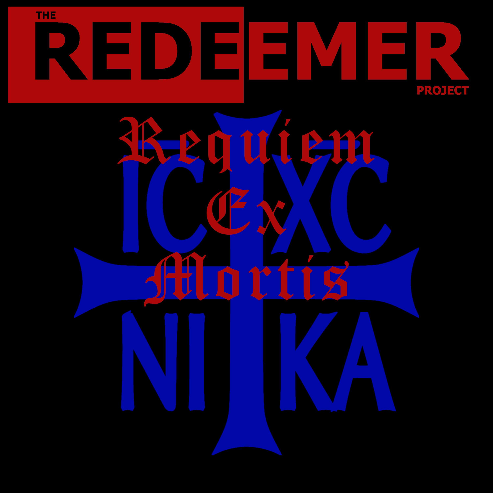
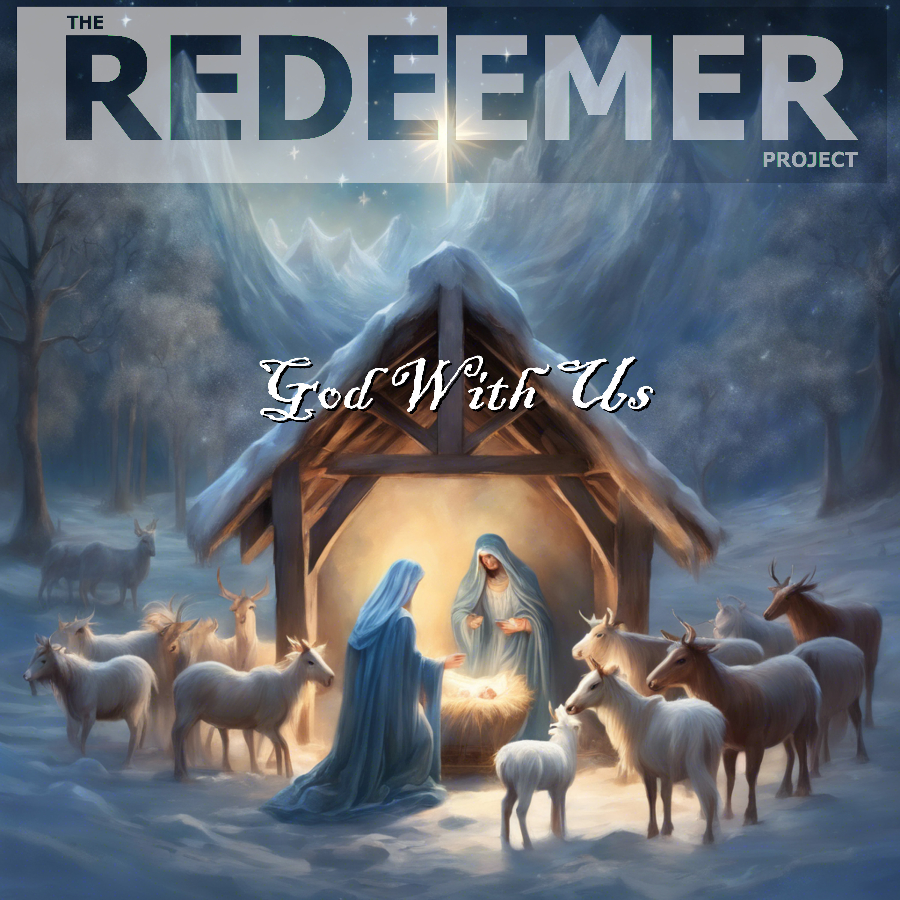
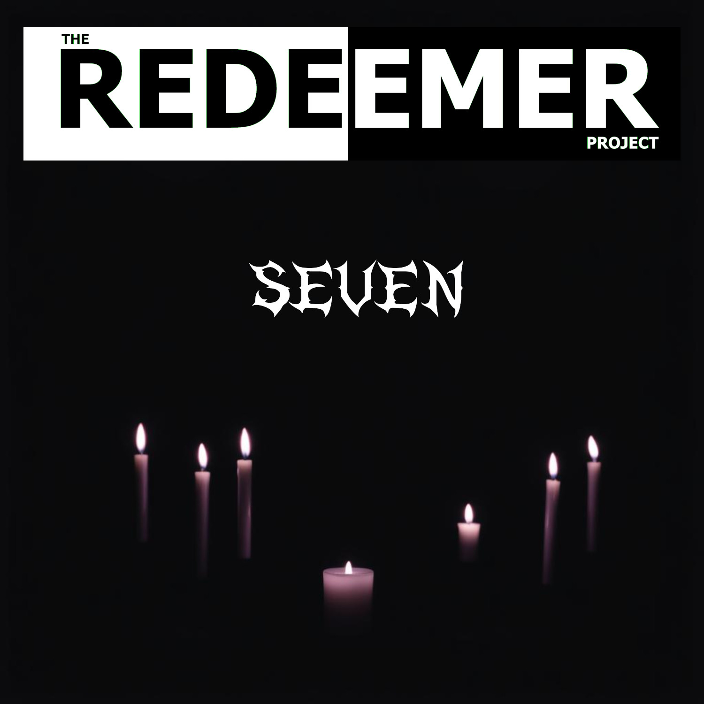

# Anonymous Download Page

Here is where you can download all my published music, free and anonymously.

These are hosted on Mega.nz - so don't expect the downloads to be fast.

If you want to stream the music, check out my [Bandcamp](https://theredeemerproject.bandcamp.com) page.

If you want to skip the whole thing and just download everything, click one of the file format links next to "Discography" below.

## Discography: [\[MP3\]](https://mega.nz/file/4FYlHZRC#71aPPD32SzTmkS0JxBbULjwYGFo9oWNy0XANsC5c_ag) [\[AAC\]](https://mega.nz/file/dYA3mLgJ#VO9EohPDHaIaUlkG3hZoq6JY3KFdbTSWQx6JgiCE8kY) [\[FLAC\]](https://mega.nz/file/cZ51BARY#ZiL6hdyvAlo7MaGssXSVuCFIyInfAch4omViViNpGxY)

### Death and Resurrection (Released April, 2024)

   

&nbsp;&nbsp;&nbsp;Available in:

&nbsp;&nbsp;&nbsp;&nbsp;&nbsp;&nbsp;[MP3](https://mega.nz/file/xYRCyZTY#3afJvylAsGdh4MMcQWIGJVsy2lWfRhmkvX8fOSh_cRs) - High Quality 320kbit MP3 format (most compatible)

&nbsp;&nbsp;&nbsp;&nbsp;&nbsp;&nbsp;[AAC](https://mega.nz/file/BFJVVBTC#uJnibT6LS5In65nPrimCrQm44EEXn98fdu8P57K7Dyk) - Apple m4a aac files (smallest)

&nbsp;&nbsp;&nbsp;&nbsp;&nbsp;&nbsp;[FLAC](https://mega.nz/file/xIhnHLzK#HTICqlmw2jdrvVLnP9LP2JVvG6lhQq2LV8kgiqc93SQ) - Lossless for audiophiles (largest file)

 

Death and Resurrection © 2024 by The Redeemer Project is licensed under CC BY-NC-ND 4.0 [Some rights reserved](https://creativecommons.org/licenses/by-nc-nd/4.0/)

### Yahweh Our Light (Released June 2024)

   

&nbsp;&nbsp;&nbsp;Available in:

&nbsp;&nbsp;&nbsp;&nbsp;&nbsp;&nbsp;[MP3](https://mega.nz/file/lRJmBQYT#r6I6mftl1d5RTMZznV6kg6UcIsuGnS6sPRwHJds2Z54) - High Quality 320kbit MP3 format (most compatible)

&nbsp;&nbsp;&nbsp;&nbsp;&nbsp;&nbsp;[AAC](https://mega.nz/file/UMp22IRQ#eqItwgwYGzzZGGw6_wFcg8VKt3_ZHbhajRlVoZASjZU) - Apple m4a aac files (smallest)

&nbsp;&nbsp;&nbsp;&nbsp;&nbsp;&nbsp;[FLAC](https://mega.nz/file/EZwziJ7K#J2tAyn-F-HkcxZnWcfA34DFe9X0GHip79YUEtYD2poA) - Lossless for audiophiles (largest file)

 

Yahweh Our Light © 2024 by The Redeemer Project is licensed under CC BY-NC-ND 4.0 [Some rights reserved](https://creativecommons.org/licenses/by-nc-nd/4.0/)

### Americana [single] (Released July 4, 2024)

   

&nbsp;&nbsp;&nbsp;Available in:

&nbsp;&nbsp;&nbsp;&nbsp;&nbsp;&nbsp;[MP3](https://mega.nz/file/dQYjWLDC#aItK4eYxt_mCCJUrcNRAe5eBFdYmpbueRqTvquL8aSo) - High Quality 320kbit MP3 format (most compatible)

&nbsp;&nbsp;&nbsp;&nbsp;&nbsp;&nbsp;[AAC](https://mega.nz/file/5V5yCYqZ#xUWG6DoFTRVE2LryH4x1eZ6R7n2zVAa_MtJMTL6dttc) - Apple m4a aac files (smallest)

&nbsp;&nbsp;&nbsp;&nbsp;&nbsp;&nbsp;[FLAC](https://mega.nz/file/MdI3jQZR#3XXQKuojs4vhoHUeoFcu5B2qKU4GR3Yq4_6HEycOS_U) - Lossless for audiophiles (largest file)

 

Americana © 2024 by The Redeemer Project is licensed under CC BY-NC-ND 4.0 [Some rights reserved](https://creativecommons.org/licenses/by-nc-nd/4.0/)

### Eliyahu (Released August, 2024)

   
&nbsp;&nbsp;&nbsp;Available in:

&nbsp;&nbsp;&nbsp;&nbsp;&nbsp;&nbsp;[MP3](https://mega.nz/file/8cxDza6A#3SUDhBH_CJaoSH7O_jmyEH8VVbKAIBIFl2tfhkbPADc) - High Quality 320kbit MP3 format (most compatible)

&nbsp;&nbsp;&nbsp;&nbsp;&nbsp;&nbsp;[AAC](https://mega.nz/file/cIIj1ZiL#fTfdawbiww09E4o1U4IwAgC0V9IvOeunVrib1fJ0iXs) - Apple m4a aac files (smallest)

&nbsp;&nbsp;&nbsp;&nbsp;&nbsp;&nbsp;[FLAC](https://mega.nz/file/oVBQDCpI#_hRROkUJ0pER7U3zeffQTKDYTElZCdyL0WfKJNtOzCs) - Lossless for audiophiles (largest file)

 

Eliyahu © 2024 by The Redeemer Project is licensed under CC BY-NC-ND 4.0 [Some rights reserved](https://creativecommons.org/licenses/by-nc-nd/4.0/)

### Requiem Ex Mortis (Released October 31, 2024)

   
&nbsp;&nbsp;&nbsp;Available in:

&nbsp;&nbsp;&nbsp;&nbsp;&nbsp;&nbsp;[MP3](https://mega.nz/file/5ApghLSQ#X_KCIr_YLGmKCelaRlShnLF4KQfkqqsPvKqPU2jyqIU) - High Quality 320kbit MP3 format (most compatible)

&nbsp;&nbsp;&nbsp;&nbsp;&nbsp;&nbsp;[AAC](https://mega.nz/file/1UYVSCpZ#29mbr_othUBS5THFN4aB2TqkkWhTFg10Qlzst5BSGXc) - Apple m4a aac files (smallest)

&nbsp;&nbsp;&nbsp;&nbsp;&nbsp;&nbsp;[FLAC](https://mega.nz/file/QZgRgIhK#bViPXlBzqiUbYNN-WsruFISvtCCHwrM_Zpu8sWghDxs) - Lossless for audiophiles (largest file)

 

Requiem Ex Mortis © 2024 by The Redeemer Project is licensed under CC BY-NC-ND 4.0 [Some rights reserved](https://creativecommons.org/licenses/by-nc-nd/4.0/)

### God With Us (Released November 29, 2024)

   
&nbsp;&nbsp;&nbsp;Available in:

&nbsp;&nbsp;&nbsp;&nbsp;&nbsp;&nbsp;[MP3](https://mega.nz/file/gFRiwJza#mKumbXyUGDCJvGPTt7n4UnrCxtSS_cLhZTC7ytq5kJ4) - High Quality 320kbit MP3 format (most compatible)

&nbsp;&nbsp;&nbsp;&nbsp;&nbsp;&nbsp;[AAC](https://mega.nz/file/dZxnFDAb#DDyfkOBCW7OLwcz1TrRE4zdcbotOjtPjGBgZ0rlO1Xw) - Apple m4a aac files (smallest)

&nbsp;&nbsp;&nbsp;&nbsp;&nbsp;&nbsp;[FLAC](https://mega.nz/file/sUxXnSSQ#V88h65L-JIVOlmwRmeohuaQ3hvO3RwzsAmP4IAvOXSg) - Lossless for audiophiles (largest file)

 

God With Us © 2024 by The Redeemer Project is licensed under CC BY-NC-ND 4.0 [Some rights reserved](https://creativecommons.org/licenses/by-nc-nd/4.0/)

### Seven (Released March 14, 2025)
 

   
&nbsp;&nbsp;&nbsp;Available in:

&nbsp;&nbsp;&nbsp;&nbsp;&nbsp;&nbsp;[MP3](https://mega.nz/file/kIRyDTKL#2eNU560DAhHhpCRnGqyzwttLi_WQaojFWWz4dyY2PdY) - High Quality 320kbit MP3 format (most compatible)

&nbsp;&nbsp;&nbsp;&nbsp;&nbsp;&nbsp;[AAC](https://mega.nz/file/dBgCSKDS#Z8xPr-zIEpS0b4jW5_qBNoUd6cZFpXPfpUaG-pYZslI) - Apple m4a aac files (smallest)

&nbsp;&nbsp;&nbsp;&nbsp;&nbsp;&nbsp;[FLAC](https://mega.nz/file/lYgnBIrK#cFaYpznJjuMkJL7KboZVlcXgHgpcLg3cAdg0YTs2Zhw) - Lossless for audiophiles (largest file)

 

Seven © 2025 by The Redeemer Project is licensed under CC BY-NC-ND 4.0 [Some rights reserved](https://creativecommons.org/licenses/by-nc-nd/4.0/)

## Other Links:

To find out more about The Redeemer Project, visit the following:

* [BandCamp](https://theredeemerproject.bandcamp.com) - Listen free, download, and support me if you feel so inclined.
* [Facebook](https://www.facebook.com/profile.php?id=61558951555423) - updates and announcements.
* [YouTube](https://youtube.com/@TheRedeemerProjectMetal/videos) - basic no-frills videos posted when I get around to making them.
* ["Band" bio](https://blog.efpophis.net/p/the-redeemer-project.html) and story.
