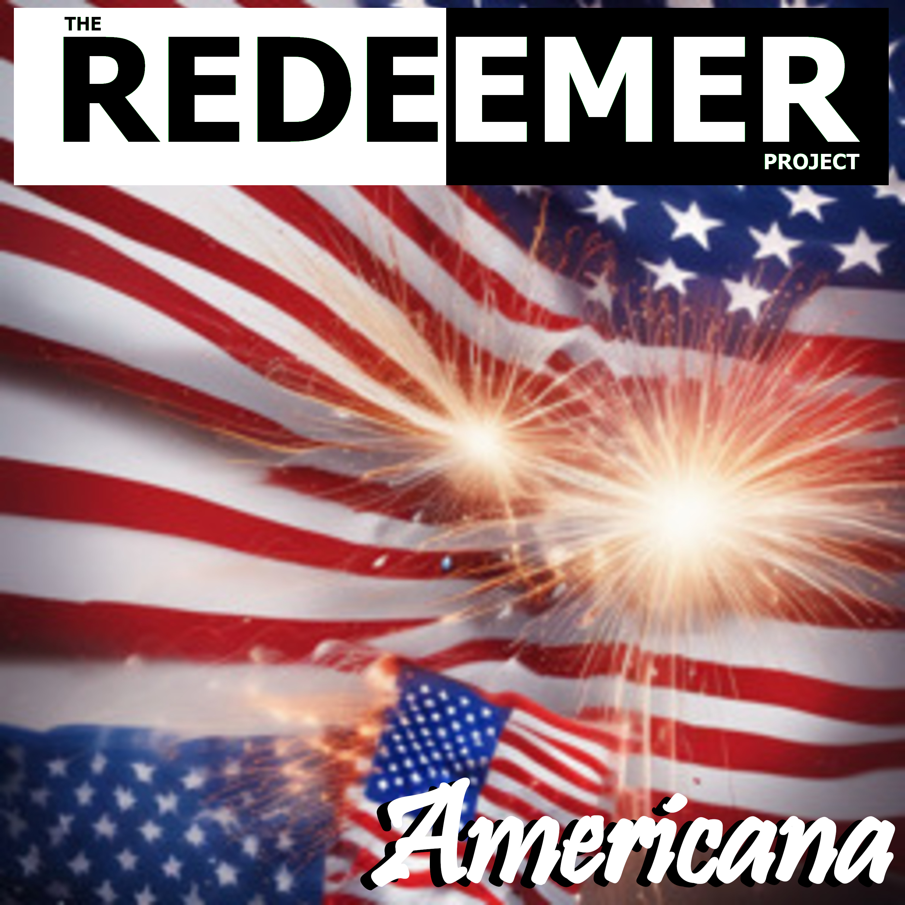

# Anonymous Download Page

Here is where you can download all my published music, free and anonymously.

These are hosted on Mega.nz - so don't expect the downloads to be fast.

If you want to stream the music, check out my [Bandcamp](https://theredeemerproject.bandcamp.com) page.

If you want to skip the whole thing and just download everything, click one of the file format links next to "Discography" below.

## Discography: [\[MP3\]](https://mega.nz/file/QRIUHCza#LOme7NvnyNRQdTxa694pOSL7EH12yAVuX25hVUT-u0E) [\[AAC\]](https://mega.nz/file/IAhjFa5Y#KIOBs5DpnT31XpZdV-V4yuhFYi6LskFHOHEH_sOug_M) [\[FLAC\]](https://mega.nz/file/9UxSQQpQ#MyqfB-nzvx7lLjO5rDjOhr0c6NowvXUYak7U16Q1Tkg)

### Death and Resurrection (Released April, 2024)

   

&nbsp;&nbsp;&nbsp;Available in:

&nbsp;&nbsp;&nbsp;&nbsp;&nbsp;&nbsp;[MP3](https://mega.nz/file/4AZlySZZ#Je4aPxZai8dKsS_cDrwPRMwXuJ_37b3OA76ZL_sdjss) - High Quality 320kbit MP3 format (most compatible)

&nbsp;&nbsp;&nbsp;&nbsp;&nbsp;&nbsp;[AAC](https://mega.nz/file/EQhkCBBQ#LoNQXmp6nj0mECG2U7h1PGsg2YXSzgFUo3TxF7QG0xI) - Apple m4a aac files (smallest)

&nbsp;&nbsp;&nbsp;&nbsp;&nbsp;&nbsp;[FLAC](https://mega.nz/file/ZdhinSKD#AhLDN_FaxFCB2hphrl3MRWh9MDaOEtFAoMm6ykX63j0) - Lossless for audiophiles (largest file)

 

Death and Resurrection © 2024 by The Redeemer Project is licensed under CC BY-NC-ND 4.0 [Some rights reserved](https://creativecommons.org/licenses/by-nc-nd/4.0/)

### Yahweh Our Light (Released June 2024)

   

&nbsp;&nbsp;&nbsp;Available in:

&nbsp;&nbsp;&nbsp;&nbsp;&nbsp;&nbsp;[MP3](https://mega.nz/file/IFBXxZyA#idpELQZtG7dkhrR4z7CBgBymUgfl1KDRHKJfTnaujIM) - High Quality 320kbit MP3 format (most compatible)

&nbsp;&nbsp;&nbsp;&nbsp;&nbsp;&nbsp;[AAC](https://mega.nz/file/FF4wgSBC#Ih5rB043Ly1peo3KQ6AmbjlmZ_4_kCXvRrLPOav4h2E) - Apple m4a aac files (smallest)

&nbsp;&nbsp;&nbsp;&nbsp;&nbsp;&nbsp;[FLAC](https://mega.nz/file/BI4kWRRY#iyhlcYF77kuF5Z3jdVXz5laMFIuvrZYxWBfvOcIJcxc) - Lossless for audiophiles (largest file)

 

Yahweh Our Light © 2024 by The Redeemer Project is licensed under CC BY-NC-ND 4.0 [Some rights reserved](https://creativecommons.org/licenses/by-nc-nd/4.0/)

### Americana [single] (Released July 4, 2024)

   

&nbsp;&nbsp;&nbsp;Available in:

&nbsp;&nbsp;&nbsp;&nbsp;&nbsp;&nbsp;[MP3](https://mega.nz/file/oJBy1YBQ#3mh25betr9Eet2qm24Bu3zR5fnDDexpEYkfReuJNF2o) - High Quality 320kbit MP3 format (most compatible)

&nbsp;&nbsp;&nbsp;&nbsp;&nbsp;&nbsp;[AAC](https://mega.nz/file/1dI2ABTR#upRhY1ycU6p662uHvf3wXwtovfvQnE0nKY4Et79z1vs) - Apple m4a aac files (smallest)

&nbsp;&nbsp;&nbsp;&nbsp;&nbsp;&nbsp;[FLAC](https://mega.nz/file/FNAS2b7R#yJBmpRdVsNaRsGKAOlEfzpuLr5ezUXqkJtqdMzFbGow) - Lossless for audiophiles (largest file)

 

Americana © 2024 by The Redeemer Project is licensed under CC BY-NC-ND 4.0 [Some rights reserved](https://creativecommons.org/licenses/by-nc-nd/4.0/)

### Eliyahu (Released August, 2024)

   
&nbsp;&nbsp;&nbsp;Available in:

&nbsp;&nbsp;&nbsp;&nbsp;&nbsp;&nbsp;[MP3](https://mega.nz/file/ZAo3GLhD#ldcL75Kr468CUu553nUdxjmMdDjkFTL4hiTVfxf6ObM) - High Quality 320kbit MP3 format (most compatible)

&nbsp;&nbsp;&nbsp;&nbsp;&nbsp;&nbsp;[AAC](https://mega.nz/file/xdAG3JoR#OzZMbJ8h6J4LWGYOaiqG2HhY0sw6c4ORgoyiIRd3J1g) - Apple m4a aac files (smallest)

&nbsp;&nbsp;&nbsp;&nbsp;&nbsp;&nbsp;[FLAC](https://mega.nz/file/IN40nQTJ#Rmwzz36Igl_ufNl6YCPVwefBMWYngMQA6SYnwsUBxp4) - Lossless for audiophiles (largest file)

 

Eliyahu © 2024 by The Redeemer Project is licensed under CC BY-NC-ND 4.0 [Some rights reserved](https://creativecommons.org/licenses/by-nc-nd/4.0/)

### Requiem Ex Mortis (Released October 31, 2024)

   
&nbsp;&nbsp;&nbsp;Available in:

&nbsp;&nbsp;&nbsp;&nbsp;&nbsp;&nbsp;[MP3](https://mega.nz/file/xUgyFLxD#c2W0skvtiseP0VN-T6PRGkvA2zdv6XKjqQJpMFhBeAo) - High Quality 320kbit MP3 format (most compatible)

&nbsp;&nbsp;&nbsp;&nbsp;&nbsp;&nbsp;[AAC](https://mega.nz/file/IEYCibDK#pz8ee8OSuCxYp4civPGRBYGKJT3Rg-HmI8uzL9F4Un8) - Apple m4a aac files (smallest)

&nbsp;&nbsp;&nbsp;&nbsp;&nbsp;&nbsp;[FLAC](https://mega.nz/file/1BwgUTwR#y8LX6RZlJs1vXuHiMQ1b6pdXPOzK5QEZV76PLqGZtBA) - Lossless for audiophiles (largest file)

 

Requiem Ex Mortis © 2024 by The Redeemer Project is licensed under CC BY-NC-ND 4.0 [Some rights reserved](https://creativecommons.org/licenses/by-nc-nd/4.0/)

### God With Us (Released November 29, 2024)

   
&nbsp;&nbsp;&nbsp;Available in:

&nbsp;&nbsp;&nbsp;&nbsp;&nbsp;&nbsp;[MP3](https://mega.nz/file/EQhymACa#yjtmUzvD4pe6Kb6pC-s4olHNsbwvA_QjGVWOBoCVRSw) - High Quality 320kbit MP3 format (most compatible)

&nbsp;&nbsp;&nbsp;&nbsp;&nbsp;&nbsp;[AAC](https://mega.nz/file/YAhEyBQQ#uojmuyI3Ux0AUEFlTiU5NQDQ0DZurXsB2ruzi46NYfk) - Apple m4a aac files (smallest)

&nbsp;&nbsp;&nbsp;&nbsp;&nbsp;&nbsp;[FLAC](https://mega.nz/file/JIZhkZ6Z#XzfOq5-qkvBIXJKpiUc_cXwuvuC1_-4fHD6UWH2hWvk) - Lossless for audiophiles (largest file)

 

God With Us © 2024 by The Redeemer Project is licensed under CC BY-NC-ND 4.0 [Some rights reserved](https://creativecommons.org/licenses/by-nc-nd/4.0/)

### Seven (Released March 14, 2025)
 

   
&nbsp;&nbsp;&nbsp;Available in:

&nbsp;&nbsp;&nbsp;&nbsp;&nbsp;&nbsp;[MP3](https://mega.nz/file/FMZEWRCC#OMtju1RF91hgCNLDC3lAMp3eHtUx0IfB12kAUwSDkqc) - High Quality 320kbit MP3 format (most compatible)

&nbsp;&nbsp;&nbsp;&nbsp;&nbsp;&nbsp;[AAC](https://mega.nz/file/4MIkTQoa#ot9vvsfrl0EFVVybIoag3F1cD2y8iriqIGnWB-FrgYQ) - Apple m4a aac files (smallest)

&nbsp;&nbsp;&nbsp;&nbsp;&nbsp;&nbsp;[FLAC](https://mega.nz/file/lRxRma6I#ELukaV_dR4Vz__dVDZyOQAxl3M33Sgj53Lgy6ZDo4bE) - Lossless for audiophiles (largest file)

 

Seven © 2025 by The Redeemer Project is licensed under CC BY-NC-ND 4.0 [Some rights reserved](https://creativecommons.org/licenses/by-nc-nd/4.0/)

## Other Links:

To find out more about The Redeemer Project, visit the following:

* [BandCamp](https://theredeemerproject.bandcamp.com) - Listen free, download, and support me if you feel so inclined.
* [Facebook](https://www.facebook.com/profile.php?id=61558951555423) - updates and announcements.
* [YouTube](https://youtube.com/@TheRedeemerProjectMetal/videos) - basic no-frills videos posted when I get around to making them.
* ["Band" bio](https://blog.efpophis.net/p/the-redeemer-project.html) and story.
